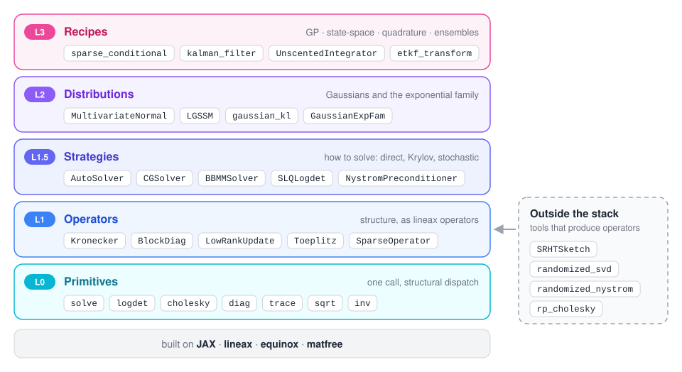
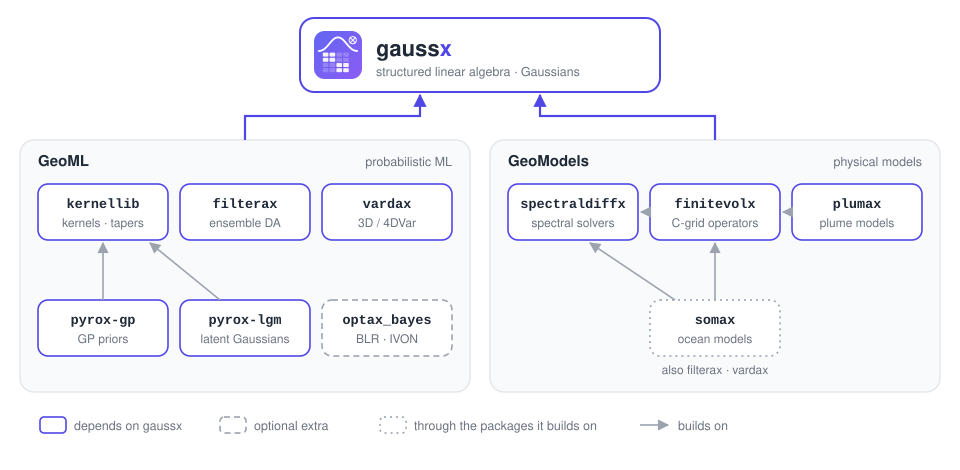

<p align="center">
  <picture>
    <source media="(prefers-color-scheme: dark)" srcset="docs/assets/logo-dark.svg">
    
  </picture>
</p>

<p align="center">
  <a href="https://github.com/jejjohnson/gaussx/actions/workflows/ci.yml"></a>
  <a href="https://github.com/jejjohnson/gaussx/actions/workflows/typecheck.yml"></a>
  
  <a href="https://opensource.org/licenses/MIT"></a>
</p>

<p align="center">
  <a href="https://jejjohnson.github.io/gaussx/"><b>Docs</b></a> ·
  <a href="https://jejjohnson.github.io/gaussx/api/"><b>API</b></a> ·
  <a href="https://jejjohnson.github.io/gaussx/architecture/"><b>Architecture</b></a> ·
  <a href="https://jejjohnson.github.io/gaussx/notebooks/basics/"><b>Examples</b></a>
</p>

<!-- --8<-- [start:intro] -->
**Structured linear algebra, Gaussian distributions, and exponential family primitives for JAX.**

Write `gaussx.solve(K, v)` once. gaussx looks at what `K` is — Kronecker, block-diagonal, low-rank, FFT-diagonalisable, sparse, or a wrapper around one of those — and takes the fast path, under `jit`, `grad` and `vmap`. Gaussians, Kalman filters and GP recipes are built on the same primitives, so they inherit that structure for free.

Built on [lineax](https://github.com/patrick-kidger/lineax), [equinox](https://github.com/patrick-kidger/equinox), and [matfree](https://github.com/pnkraemer/matfree).
<!-- --8<-- [end:intro] -->

<!-- --8<-- [start:install] -->
## Installation

gaussx is not on PyPI yet; install it from GitHub:

```bash
pip install "gaussx @ git+https://github.com/jejjohnson/gaussx.git"
```

or with `uv`:

```bash
uv add "gaussx @ git+https://github.com/jejjohnson/gaussx.git"
```

Add the `numpyro` extra (`gaussx[numpyro] @ git+...`) for the NumPyro-compatible distributions.
<!-- --8<-- [end:install] -->

<!-- --8<-- [start:quickstart] -->
## Quick Start

```python
import jax.numpy as jnp
import lineax as lx
import numpyro.distributions as dist
from jaxtyping import Array, Float

import gaussx

Op = lx.AbstractLinearOperator
Dist = dist.Distribution

# K = A ⊗ B, a (6, 6) covariance that is never materialised.
A: Op = lx.DiagonalLinearOperator(jnp.array([1.0, 2.0, 3.0]))  # (3, 3)
B: Op = lx.DiagonalLinearOperator(jnp.array([4.0, 5.0]))  # (2, 2)
K: gaussx.Kronecker = gaussx.Kronecker(A, B)  # (6, 6)

v: Float[Array, " 6"] = jnp.ones(6)  # (6,)
# Per-factor solves: O(3³ + 2³) instead of O(6³).
x: Float[Array, " 6"] = gaussx.solve(K, v)  # (6,)
ld: Float[Array, ""] = gaussx.logdet(K)  # (): n_B · logdet(A) + n_A · logdet(B)
L: gaussx.Kronecker = gaussx.cholesky(K)  # (6, 6): Kronecker(chol(A), chol(B))

# A Gaussian over K, with a pluggable solver strategy.
mvn: Dist = gaussx.MultivariateNormal(
    loc=jnp.zeros(6),  # (6,)
    cov_operator=K,  # (6, 6)
    solver=gaussx.DenseSolver(),
)
log_p: Float[Array, ""] = mvn.log_prob(v)  # ()
```
<!-- --8<-- [end:quickstart] -->

<!-- --8<-- [start:gp-example] -->
## Example: one Gaussian process, five ways

A GP marginal likelihood is `gaussian_log_prob(0, K_y, y)` whatever `K_y` is. Change the operator and the same call runs a dense Cholesky, a Kronecker eigendecomposition, a Woodbury solve, or an iterative BBMM solve.

```python
import einx
import jax
import jax.numpy as jnp
import jax.random as jr
import lineax as lx
from jaxtyping import Array, Float

import gaussx

Op = lx.AbstractLinearOperator
Scalar = Float[Array, ""]
PSD = lx.positive_semidefinite_tag

# Shapes: N = 20 × 20 = 400 grid points, M = 8 × 8 = 64 inducing points,
#         T = 10 × 10 = 100 test points, n = 20 points per grid axis
# k(x, x') = k(x₁, x₁') k(x₂, x₂'),  k(a, b) = exp(−(a − b)² / 2ℓ²),  ℓ = 0.2


def rbf(a: Float[Array, " n"], b: Float[Array, " m"]) -> Float[Array, "n m"]:
    return jnp.exp(-0.5 * einx.subtract("n, m -> n m", a, b) ** 2 / 0.2**2)


g: Float[Array, " n"] = jnp.linspace(0, 1, 20)  # (n,) grid axis
z: Float[Array, " 8"] = jnp.linspace(0, 1, 8)  # (8,) inducing axis
s: Float[Array, " 10"] = jnp.linspace(0, 1, 10)  # (10,) test axis
jitter: float = 1e-6  # keeps the Gram matrices numerically PD
K1: Float[Array, "n n"] = rbf(g, g) + jitter * jnp.eye(20)  # (n,) → (n, n)

# y = f(x) + ε,  f(x) = sin 6x₁ · cos 4x₂,  ε ~ 𝒩(0, σ²),  σ² = 0.01
f: Float[Array, " N"] = einx.multiply(  # (n,), (n,) → (N,)
    "a, b -> (a b)", jnp.sin(6 * g), jnp.cos(4 * g)
)
y: Float[Array, " N"] = f + 0.1 * jr.normal(jr.key(0), f.shape)  # (N,)
noise: float = 0.01  # σ²
zeros: Float[Array, " N"] = jnp.zeros(400)  # (N,) prior mean

# 1. Exact: K_y = K + σ²I, a dense Cholesky, O(N³)
K_y: Op = lx.MatrixLinearOperator(jnp.kron(K1, K1) + noise * jnp.eye(400), PSD)
# log p(y) = log 𝒩(y; 0, K_y)
mll_exact: Scalar = gaussx.gaussian_log_prob(zeros, K_y, y)  # (N,) → ()

# 2. Grid: K_y = K₁ ⊗ K₁ + σ² I ⊗ I, per-factor eigh, O(n³); equals mll_exact
K1_op: Op = lx.MatrixLinearOperator(K1, PSD)  # (n, n)
I_op: Op = lx.MatrixLinearOperator(jnp.eye(20), PSD)  # (n, n)
noise_op: Op = lx.MatrixLinearOperator(noise * jnp.eye(20), PSD)  # (n, n)
K_grid: Op = gaussx.SumOfKroneckers(
    gaussx.Kronecker(K1_op, K1_op),  # (N, N)
    gaussx.Kronecker(noise_op, I_op),  # (N, N)
)
mll_grid: Scalar = gaussx.gaussian_log_prob(zeros, K_grid, y)  # (N,) → ()

# 3. Inducing points: K_y ≈ Q + σ²I,  Q = K_xz K_zz⁻¹ K_zx = U Uᵀ, Woodbury O(N M²)
K_xz: Float[Array, "N M"] = jnp.kron(rbf(g, z), rbf(g, z))  # (N, M)
# (M, M), jittered
K_zz: Float[Array, "M M"] = jnp.kron(rbf(z, z), rbf(z, z)) + jitter * jnp.eye(64)
L_zz: Float[Array, "M M"] = jnp.linalg.cholesky(K_zz)  # (M, M)
U: Float[Array, "N M"] = einx.id(  # U = K_xz L_zz⁻ᵀ
    "m n -> n m",
    jax.scipy.linalg.solve_triangular(L_zz, einx.id("n m -> m n", K_xz), lower=True),
)
K_dtc: Op = gaussx.low_rank_plus_identity(U, scale=noise, psd=True)  # (N, N), rank M
mll_dtc: Scalar = gaussx.gaussian_log_prob(zeros, K_dtc, y)  # (N,) → ()
# Titsias' bound: log 𝒩(y; 0, Q + σ²I) − tr(K − Q) / 2σ²  ≤  mll_exact
elbo: Scalar = gaussx.collapsed_elbo(y, jnp.ones(400), K_xz, K_zz, noise)  # ()

# 4. Same K_y, iterative numerics: CG solves + stochastic Lanczos logdet (BBMM)
mll_bbmm: Scalar = gaussx.gaussian_log_prob(  # ≈ mll_exact, up to SLQ's MC error
    zeros, K_y, y, solver=gaussx.BBMMSolver(), key=jr.key(1)
)

# 5. Prediction: α = K_y⁻¹ y once;  μ* = K_*x α,  σ²* = k_** − k_*ᵀ K_y⁻¹ k_*
K_sx: Float[Array, "T N"] = jnp.kron(rbf(s, g), rbf(s, g))  # (T, N)
cache: gaussx.PredictionCache = gaussx.build_prediction_cache(K_grid, y)  # α, (N,)
mu: Float[Array, " T"] = gaussx.predict_mean(cache, K_sx)  # (T, N) → (T,)
var: Float[Array, " T"] = gaussx.predict_variance(cache, K_sx, jnp.ones(100))  # (T,)

# LOVE: a rank-k Lanczos cache of K_y⁻¹, then O(N k) per test point
love: gaussx.LOVECache = gaussx.love_cache(K_y, lanczos_order=100)  # k = 100
var_love: Float[Array, " T"] = 1.0 - jax.vmap(  # (T, N) → (T,)
    lambda k_s: gaussx.love_variance(love, k_s)
)(K_sx)
```

Every path runs under `jax.jit` and differentiates with `jax.grad`: the Kronecker path's gradient with respect to the lengthscale matches the dense one.
<!-- --8<-- [end:gp-example] -->

## What structure buys you

Every primitive dispatches on the operator it is given. A dense matrix costs $O(n^3)$ to solve or factor; these do not:

| Operator | Represents | `solve` | `logdet` |
|---|---|---|---|
| `Kronecker` | $A_1 \otimes \cdots \otimes A_k$, $N = \prod_i n_i$ | $O(\sum_i n_i^3 + N \sum_i n_i)$, per factor | $O(\sum_i n_i^3)$, scaled sum |
| `KroneckerSum` | $A \oplus B = A \otimes I + I \otimes B$ | joint eigenbasis, $O(n_A^3 + n_B^3 + N(n_A + n_B))$ | $\sum_{ij} \log(\lambda_i + \mu_j)$ |
| `SumOfKroneckers` | $A_1 \otimes B_1 + A_2 \otimes B_2$ | whiten + per-factor `eigh` | eigenvalue sum |
| `BlockDiag` | $\mathrm{diag}(A_1, \ldots, A_k)$ | $O(\sum_i b_i^3)$, per block | $O(\sum_i b_i^3)$, per block |
| `BlockTriDiag` | symmetric block-tridiagonal, $T$ blocks of $d$ | $O(T d^3)$, block Cholesky | $O(T d^3)$ |
| `LowRankUpdate` | $D + U C V^\top$, rank $k$ | $O(n k^2 + k^3)$, Woodbury | $O(n k^2 + k^3)$, determinant lemma |
| `DiagonalizedOperator` | $V^{-1} \mathrm{diag}(\lambda) V$ (FFT, DCT, `circulant`) | $O(n \log n)$, transform pair | $O(n)$, $\sum \log \lvert\lambda\rvert$ |
| `SparseOperator` | sparse matrix on a static pattern | sparse Cholesky, or CG when large and PSD | sparse Cholesky, or an SLQ estimate |
| `MaskedOperator` | rows / columns of a base operator | capacitance solve | dense |
| `Toeplitz`, `InterpolatedOperator` | stationary kernels on grids, KISS-GP | $O(n \log n)$ matvecs for CG | SLQ via a strategy |
| `c * A`, `-A`, `A @ B`, tagged `A` | wrappers | unwrap and recurse | unwrap and recurse |

Everything else falls back to an exact dense solve, or to the iterative strategy you pass (`CGSolver`, `BBMMSolver`, …), and paths that densify a structured operator warn. The [architecture page](https://jejjohnson.github.io/gaussx/architecture/) has the full operator × primitive table.

## Architecture

<p align="center">
  <picture>
    <source media="(prefers-color-scheme: dark)" srcset="docs/assets/architecture-dark.svg">
    
  </picture>
</p>

Each layer only uses the ones beneath it, so you can enter wherever your problem lives. The [architecture page](https://jejjohnson.github.io/gaussx/architecture/) has the dispatch tables.

## Where it is used

<p align="center">
  <picture>
    <source media="(prefers-color-scheme: dark)" srcset="docs/assets/ecosystem-dark.svg">
    
  </picture>
</p>

gaussx is the shared linear-algebra layer of the GeoML stack ([kernellib](https://github.com/jejjohnson/kernellib), [filterax](https://github.com/jejjohnson/filterax), [vardax](https://github.com/jejjohnson/vardax), [pyrox](https://github.com/jejjohnson/pyrox), [optax_bayes](https://github.com/jejjohnson/optax_bayes)) and of the GeoModels stack ([spectraldiffx](https://github.com/jejjohnson/spectraldiffx), [finitevolX](https://github.com/jejjohnson/finitevolX), [plumax](https://github.com/jejjohnson/plumax), [somax](https://github.com/jejjohnson/somax)).

<!-- --8<-- [start:inside] -->
## What's Inside

Each heading links to its API reference; these are the highlights, not the full list.

### Layer 0 -- [Primitives](https://jejjohnson.github.io/gaussx/api/primitives/) and [linear-algebra utilities](https://jejjohnson.github.io/gaussx/api/linalg/)

Pure functions with `isinstance` dispatch on the operator's structure: `solve` · `logdet` · `cholesky` · `diag` · `trace` · `sqrt` · `inv` · `eig` · `svd` · `root_decomposition`, plus `woodbury_solve`, `schur_complement`, `safe_cholesky` and `tridiagonal_solve`.

### Layer 1 -- [Operators](https://jejjohnson.github.io/gaussx/api/operators/)

lineax operators, immutable equinox pytrees safe under `jit` / `grad` / `vmap`: `Kronecker` · `KroneckerSum` · `SumOfKroneckers` · `BlockDiag` · `BlockTriDiag` · `LowRankUpdate` · `DiagonalizedOperator` · `Toeplitz` · `InterpolatedOperator` · `MaskedOperator` · `SparseOperator`, and lazy algebra with `sum_operator`, `scaled_operator` and `product_operator`.

### Layer 1.5 -- [Solver strategies & preconditioners](https://jejjohnson.github.io/gaussx/api/solvers/)

How to solve, decoupled from what: `DenseSolver` · `AutoSolver` · `CGSolver` · `PreconditionedCGSolver` · `MINRESSolver` · `BBMMSolver` with `SLQLogdet`, preconditioned by `JacobiPreconditioner`, `NystromPreconditioner` or `PartialCholeskyPreconditioner`. `linear_solve` is the front door.

### Layer 2 -- [Distributions & exponential family](https://jejjohnson.github.io/gaussx/api/distributions/)

`MultivariateNormal` and `MultivariateNormalPrecision` (NumPyro-compatible), `MarkovGaussian`, `LGSSM`, the sugar built on them (`gaussian_log_prob`, `gaussian_kl`, `conditional`, `joseph_update`), and `GaussianExpFam` for natural / expectation parameters.

### Layer 3 -- Recipes

- **[Gaussian processes](https://jejjohnson.github.io/gaussx/api/gp/)**: `sparse_conditional`, `collapsed_elbo`, `kronecker_mll`, `love_cache`, `matheron_update`, `oilmm_project`
- **[State-space models](https://jejjohnson.github.io/gaussx/api/ssm/)**: `kalman_filter`, `rts_smoother`, `parallel_kalman_filter`, `dare`, `sde_kl_divergence`, SDE kernels such as `MaternSDE`
- **[Quadrature & uncertainty propagation](https://jejjohnson.github.io/gaussx/api/quadrature/)**: `UnscentedIntegrator`, `GaussHermiteIntegrator`, `ep_tilted_moments`, `uncertain_gp_predict`
- **[Inference & ensembles](https://jejjohnson.github.io/gaussx/api/inference/)**: `blr_full_update`, `damped_natural_update`, `ensemble_kalman_gain`, `etkf_transform`, `laplace_mode`

### Outside the stack

[Sketching](https://jejjohnson.github.io/gaussx/api/sketching/) (`SRHTSketch`, `hadamard_transform`) and [randomized linear algebra](https://jejjohnson.github.io/gaussx/api/randomized/) (`randomized_svd`, `randomized_nystrom`, `rp_cholesky`) produce operators and factors for the layers above.
<!-- --8<-- [end:inside] -->

<!-- --8<-- [start:api-notes] -->
## API Notes

A few usage details that are easy to miss:

- `gaussx.kronecker_posterior_predictive(...)` requires `K_test_diag_factors=` so predictive variances use the exact prior diagonal at the test points instead of reconstructing it from cross-covariances.
- `gaussx.ssm_to_naturals(A, Q, mu_0, P_0)` takes the transition noise `Q` of shape `(N-1, d, d)` and `P_0` separately, the same layout as `gaussx.MarkovGaussian`. The older stacked layout (`Q[0] == P_0`) is deprecated and will be removed in gaussx 0.7.0; with it, an inconsistent initial covariance raises an `EquinoxRuntimeError` (via `equinox.error_if`), eagerly and at run time under `jax.jit` / `jax.vmap`.
- `gaussx.SumKronecker` and `gaussx.SVDLowRankUpdate` are **deprecated** aliases (for `SumOfKroneckers` and `LowRankUpdate(..., orthonormal=True)`); both warn on construction and will be removed in gaussx 0.7.0.
- Kernel operators, Nyström / RFF operators, HSIC / MMD, Falkon and EigenPro moved to [kernellib](https://github.com/jejjohnson/kernellib) in 0.2.0. They are lineax operators and work with every gaussx primitive and strategy.
<!-- --8<-- [end:api-notes] -->

## Development

```bash
git clone https://github.com/jejjohnson/gaussx.git
cd gaussx
make install      # install all dependency groups
make test         # run tests
make lint         # ruff check .
make typecheck    # ty check src/gaussx
make docs-serve   # preview docs locally
```

## License

MIT
