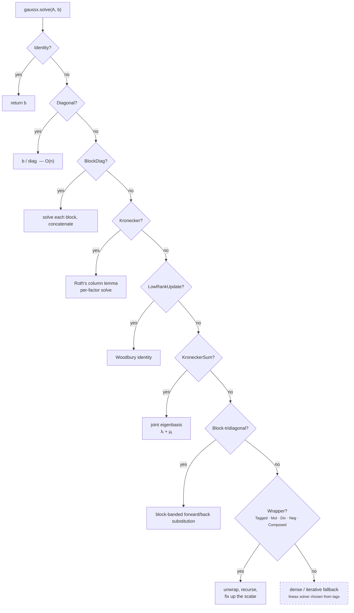
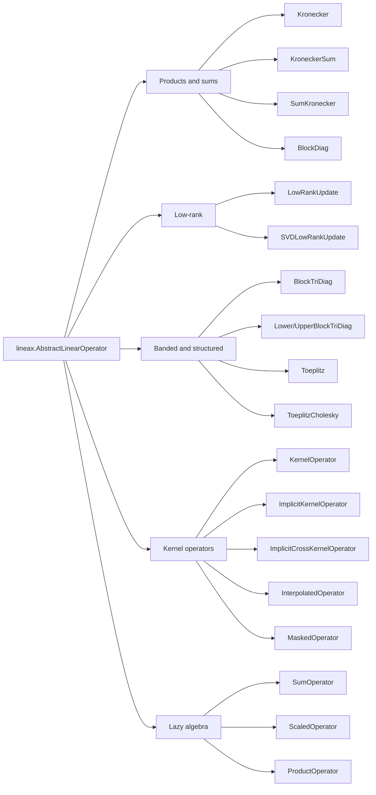
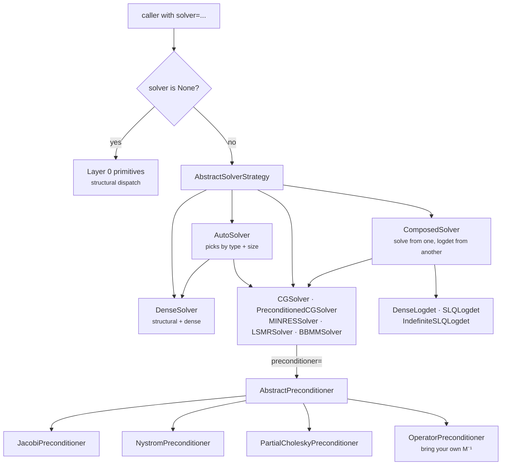
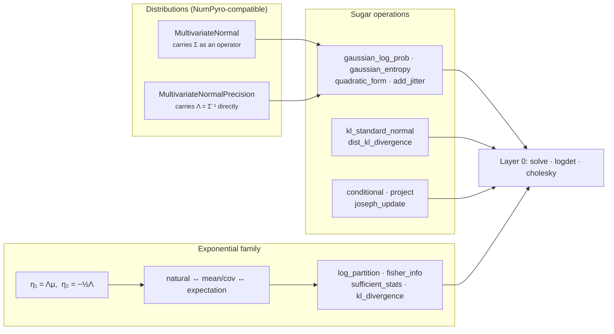
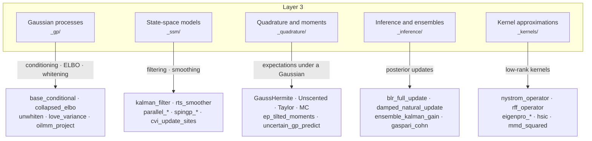
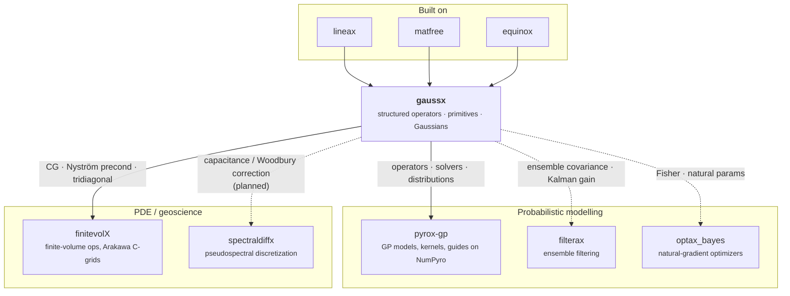

# Architecture

gaussx is organised as a **layered stack** on top of
[lineax](https://github.com/patrick-kidger/lineax) and
[matfree](https://github.com/pnkraemer/matfree). Each layer is usable on its
own, and each layer only depends on the ones beneath it. You can enter wherever
your problem lives: grab a single primitive, build a structured operator, swap a
solver strategy, or call a finished recipe.

## The stack at a glance

```mermaid
flowchart TB
    subgraph L3["Layer 3 · Recipes"]
        direction LR
        GP["Gaussian processes<br/><small>conditioning · ELBOs · whitening · LOVE · OILMM</small>"]
        SSM["State-space models<br/><small>SDE kernels · Kalman · RTS · SpInGP · CVI</small>"]
        QUAD["Quadrature<br/><small>Gauss-Hermite · unscented · Taylor · MC</small>"]
        INF["Inference and ensembles<br/><small>BLR · natural gradient · EnKF</small>"]
        KERN["Kernels<br/><small>Nyström · RFF · EigenPro · HSIC/MMD</small>"]
    end

    subgraph L2["Layer 2 · Distributions and sugar"]
        direction LR
        DIST["MultivariateNormal<br/>MultivariateNormalPrecision"]
        SUGAR["log_prob · entropy · KL<br/>conditional · Joseph · project"]
        EF["Exponential family<br/><small>natural ↔ expectation · Fisher</small>"]
    end

    subgraph L15["Layer 1.5 · Strategies and preconditioners"]
        direction LR
        STRAT["DenseSolver · CGSolver · BBMM<br/>MINRES · LSMR · SLQ logdet"]
        PRE["Jacobi · Nyström<br/>PartialCholesky · Operator"]
        FRONT["linear_solve<br/><small>the front door</small>"]
    end

    subgraph L1["Layer 1 · Operators"]
        direction LR
        OPS["Kronecker · KroneckerSum · BlockDiag<br/>BlockTriDiag · LowRankUpdate · Toeplitz<br/>Kernel · Implicit · Interpolated · Masked"]
        TAGS["Structural tags<br/><small>_tags.py</small>"]
    end

    subgraph L0["Layer 0 · Primitives"]
        PRIM["solve · logdet · cholesky · diag · trace<br/>sqrt · inv · eig · svd · root_decomposition"]
        LINALG["Linear-algebra utilities<br/><small>Woodbury · Schur · safe_cholesky · tridiagonal</small>"]
    end

    subgraph EXT["Foundations"]
        direction LR
        LINEAX["lineax<br/><small>solvers · AbstractLinearOperator · tags</small>"]
        MATFREE["matfree<br/><small>Lanczos · SLQ · Hutchinson</small>"]
        EQXDEP["equinox · jaxtyping · einx"]
    end

    L3 --> L2
    L2 --> L15
    L15 --> L1
    L1 --> L0
    L0 --> EXT
```



| Layer | Name | Owns | Entry point |
|-------|------|------|-------------|
| 0 | **Primitives** | Pure functions with structural dispatch | [`solve`, `logdet`, `cholesky`, …](api/primitives.md) |
| 1 | **Operators** | Structured matrices + tags | [`Kronecker`, `BlockDiag`, …](api/operators.md) |
| 1.5 | **Strategies** | *How* a solve/logdet is computed | [`DenseSolver`, `CGSolver`, …](api/solvers.md) |
| 2 | **Distributions** | Gaussians over operators, sugar ops, exp-family | [`MultivariateNormal`, …](api/distributions.md) |
| 3 | **Recipes** | Domain sequences wiring layers 0–2 | [GP](api/gp.md) · [SSM](api/ssm.md) · [quadrature](api/quadrature.md) · [inference](api/inference.md) · [kernels](api/kernels.md) |

---

## Layer 0 --- Primitives

Pure functions that match the equations in papers. Every one takes a
`lineax.AbstractLinearOperator` and returns arrays or operators:

```python
x     = gaussx.solve(A, b)   # solve A x = b
ld    = gaussx.logdet(A)     # log|det(A)|
L     = gaussx.cholesky(A)   # A = L L^T   (lazy, structure-preserving)
d     = gaussx.diag(A)       # diagonal entries
t     = gaussx.trace(A)      # tr(A)
S     = gaussx.sqrt(A)       # S with S S = A
A_inv = gaussx.inv(A)        # lazy A^{-1}
```

Two properties are worth internalising:

- **Lazy over dense.** `cholesky`, `sqrt`, and `inv` return *operators*.
  The Cholesky of a `Kronecker` is a `Kronecker` of Cholesky factors; nothing
  is materialized until you call `.as_matrix()`.
- **The expensive surprise is flagged.** `cholesky(SumKronecker)` is the one
  path where a structured operator you would reasonably expect to stay
  structured must materialize the dense covariance, so it raises a
  [`DenseFallbackWarning`](api/primitives.md#gaussx.DenseFallbackWarning) and
  points you at `sqrt(...)` / `sumkronecker_sample(...)` instead. Ordinary
  unstructured operators densify quietly --- there was never a fast path to
  lose.

### How dispatch actually works

No registry, no metaclass, no plugin system. Each primitive is a chain of
`isinstance` checks in a single readable function, ending in a dense fallback:



`logdet`, `cholesky`, `diag`, `trace`, `sqrt`, and `inv` follow the same shape
with their own fast paths. Coverage differs per primitive --- `sqrt`, for
instance, has no block-tridiagonal path and falls back there.

| Operator | `solve` | `logdet` | `cholesky` | `diag` / `trace` | `sqrt` | `inv` |
|----------|---------|----------|------------|------------------|--------|-------|
| `Identity` / `Diagonal` | O(n) | O(n) | O(n) | O(n) | O(n) | O(n) |
| `BlockDiag` | per block | sum of logdets | per block | per block | per block | per block |
| `Kronecker` | Roth's lemma | scaled sum | per factor | per factor | per factor | per factor |
| `KroneckerSum` | joint eigenbasis | $\sum \log(\lambda_i + \mu_j)$ | dense | eigen-based | `KroneckerSumSqrt` | lazy |
| `SumKronecker` | dense | dense | dense (warns) | per term | `SumKroneckerSqrt` | lazy |
| `LowRankUpdate` | Woodbury | determinant lemma | dense | base + update | dense | Woodbury (if symmetric) |
| `BlockTriDiag` | block-banded | block Cholesky | block Cholesky | per block | dense | lazy |
| Wrappers (`Tagged`, `Mul`, `Div`, `Neg`, `Composed`) | unwrap + recurse | unwrap + recurse | unwrap | unwrap + recurse | unwrap | unwrap + recurse |
| Everything else | lineax solver | `slogdet` | `jax.scipy` Cholesky | dense | dense eigh | lazy `InverseOperator` |

Several of the dense cells have an opt-in matrix-free escape hatch backed by
[matfree](https://github.com/pnkraemer/matfree):

- `diag(A, stochastic=True)` and `trace(A, stochastic=True)` switch to
  Hutchinson / XTrace probing. `trace_and_diag` shares a single probe pass
  between both estimates.
- `sqrt(A, lanczos_order=k)` returns a lazy `SqrtOperator` that routes its
  matvecs through Lanczos instead of an eigendecomposition.

For `logdet`, the matrix-free route is a Layer 1.5 concern rather than a
primitive flag: pass `SLQLogdet()` (or a `ComposedSolver`) as the `solver=`.

---

## Layer 1 --- Operators

Structured operators extending `lineax.AbstractLinearOperator`. Each is an
`equinox.Module` --- an immutable PyTree, safe under `jit`, `grad`, and `vmap`
--- supporting `mv`, `as_matrix`, `transpose`, and carrying structural tags.



| Operator | Represents | Why it is worth it |
|----------|-----------|--------------------|
| `Kronecker(A, B, ...)` | $A \otimes B \otimes \cdots$ | $O(\sum_i n_i^3)$ instead of $O((\prod_i n_i)^3)$; matvec is Roth's column lemma via einx |
| `KroneckerSum(A, B)` | $A \oplus B = A \otimes I + I \otimes B$ | Diagonalises in the joint eigenbasis, eigenvalues $\lambda_i + \mu_j$ |
| `SumKronecker` | $\sum_k A_k \otimes B_k$ | Structured Cholesky/sqrt for separable-plus-noise covariances |
| `BlockDiag(A, B, ...)` | $\mathrm{diag}(A, B, \ldots)$ | Every primitive splits per block |
| `BlockTriDiag(D, A)` | Symmetric block-tridiagonal precision | $O(N d^3)$ --- the precision structure of Markovian GPs |
| `LowRankUpdate(L, U, d, V)` | $L + U\,\mathrm{diag}(d)\,V^\top$ | Woodbury solves, determinant-lemma logdets |
| `SVDLowRankUpdate` | SVD-factored low-rank update | Numerically safer when the update is ill-conditioned |
| `Toeplitz` | Symmetric Toeplitz | $O(n \log n)$ matvecs and sampling via FFT circulant embedding |
| `KernelOperator(k, X)` | Dense Gram matrix | Kernel as a first-class operator |
| `ImplicitKernelOperator(k, X)` | Matrix-free Gram operator | Rows generated per matvec --- never stores $N \times N$ |
| `InterpolatedOperator` | $W K_{uu} W^\top$ (KISS-GP style) | Grid interpolation weights, sparse in effect |
| `MaskedOperator` | Row/column sub-selection of a base operator | Irregular domains, held-out indices |

Arithmetic composes with lineax's own operators, and the primitives unwrap the
composition automatically:

```python
K = gaussx.Kronecker(A, B)
perturbed = K + 0.1 * lx.IdentityLinearOperator(K.in_structure())
gaussx.solve(perturbed, y)   # dispatches through the sum
```

!!! warning "Tags are claims, not inferences"
    `ImplicitKernelOperator` (and friends) will not guess that your kernel is
    symmetric or PSD. If you want the Cholesky/CG fast paths, pass the tags
    explicitly:

    ```python
    op = gaussx.ImplicitKernelOperator(
        kernel_fn, X,
        tags=frozenset({lx.symmetric_tag, lx.positive_semidefinite_tag}),
    )
    ```

### Structural tags

Tags mark structure and properties; the `is_*` predicates are what the
primitives consult. gaussx re-exports lineax's property tags so user code needs
only one import.

| Tag | Source | Consulted by |
|-----|--------|--------------|
| `symmetric_tag` | lineax | solve, logdet, solver selection |
| `positive_semidefinite_tag` | lineax | cholesky, sqrt, CG, SLQ |
| `negative_semidefinite_tag` | lineax | `linear_solve` negation path |
| `diagonal_tag` | lineax | all primitives (O(n) paths) |
| `lower_triangular_tag` / `upper_triangular_tag` | lineax | triangular solves |
| `unit_diagonal_tag` / `tridiagonal_tag` | lineax | specialised solves |
| `kronecker_tag` | gaussx | all primitives (per factor) |
| `kronecker_sum_tag` | gaussx | eigenbasis paths |
| `block_diagonal_tag` | gaussx | all primitives (per block) |
| `block_tridiagonal_tag` | gaussx | banded Cholesky |
| `low_rank_tag` | gaussx | solve (Woodbury), logdet (determinant lemma) |

Query with `is_kronecker`, `is_low_rank`, `is_positive_semidefinite`, … to
inspect an operator without knowing its concrete type. Full list in the
[Operators & Tags](api/operators.md) reference.

---

## Layer 1.5 --- Strategies & preconditioners

A **strategy** bundles a `solve` and a `logdet` algorithm behind one object.
Anything in gaussx that takes a `solver=` keyword takes one of these, and
`solver=None` means "use structural dispatch".



| Strategy | Algorithm | Best for |
|----------|-----------|----------|
| `DenseSolver` | Structural dispatch, Cholesky for PSD | Small/medium, structured |
| `AutoSolver` | Structured → dense; small → dense; large PSD → CG | When you would rather not choose |
| `CGSolver` | Conjugate gradients (+ optional preconditioner) | Large PSD, matrix-free |
| `PreconditionedCGSolver` | CG with a required preconditioner | Ill-conditioned kernel matrices |
| `MINRESSolver` | MINRES | Symmetric indefinite |
| `LSMRSolver` | LSMR | Least squares / rectangular |
| `BBMMSolver` | Batched blocked matrix-matrix CG | Many right-hand sides at once |
| `ComposedSolver` | Any solve + any logdet | The standard large-kernel recipe: CG solve, SLQ logdet |
| `DenseLogdet` | Eigendecomposition | Exactness |
| `SLQLogdet` / `IndefiniteSLQLogdet` | Stochastic Lanczos quadrature | Large PSD / symmetric-indefinite estimates |

`AutoSolver`'s rule is deliberately boring and readable: structured operators go
to `DenseSolver` (structural dispatch is already the fast path), dense operators
below `size_threshold` (default 1000) go to `DenseSolver`, large PSD operators
go to `CGSolver`, everything else falls back to `DenseSolver`.

### The front door

[`linear_solve`](api/solvers.md#gaussx.linear_solve) is the high-level entry
point. It accepts a lineax operator *or* a bare `(matvec, in_structure)` pair,
normalises negative-definite systems, picks an iterative solver from the
operator's tags, and threads a preconditioner through.
`as_linear_operator` wraps a raw matvec callable into a tagged
`FunctionLinearOperator` for matrix-free workflows.

`AbstractPreconditioner.as_operator(A)` receives the *system* operator, so
static preconditioners (Jacobi, or an externally supplied approximate inverse)
can ignore it while data-dependent ones (partial Cholesky) build their factor
lazily at solve time. This is the seam through which PDE packages inject their
own approximate inverses --- a spectral solve or a multigrid V-cycle is wrapped
in `OperatorPreconditioner` and passed in, so **gaussx never imports the
packages that build them**.

---

## Layer 2 --- Distributions & sugar



- **`MultivariateNormal(loc, cov_operator, solver=...)`** takes *any* covariance
  operator and *any* solver strategy. The distribution owns the math; the
  strategy owns the numerics.
- **`MultivariateNormalPrecision`** carries $\Lambda = \Sigma^{-1}$ directly ---
  the natural home for natural-parameter guides, where materializing $\Sigma$
  would be wasted work.
- Both require `numpyro`, which is an **optional** dependency. The rest of
  gaussx imports fine without it (see the guarded import at the bottom of
  `src/gaussx/__init__.py`).
- **Sugar ops** evaluate $\log\mathcal{N}(x \mid \mu, \Sigma)$, entropy,
  quadratic forms, KLs, conditioning, and the numerically stable Joseph-form
  covariance update --- all through structured `solve` + `logdet`.
- **Exponential family** provides the conversions (mean/cov ↔ natural ↔
  expectation), log-partition, Fisher information, and sufficient statistics
  that natural-gradient and EP updates are built from.

---

## Layer 3 --- Recipes

Layer 3 is thin wiring: domain-specific sequences of Layer 0–2 operations. It is
where the library stops being linear algebra and starts being *someone's
method*. Five families, each with its own API page.



**Gaussian processes** ([API](api/gp.md)) --- posterior conditioning, prediction
caches, Matheron pathwise sampling, whitened parameterizations, Gaussian and MC
ELBOs, the collapsed (Titsias) bound, LOVE predictive variances, closed-form
leave-one-out CV, Kronecker GP marginal likelihood, and OILMM multi-output
projections.

**State-space models** ([API](api/ssm.md)) --- stationary 1-D kernels with
rational spectral densities have exact SDE representations, turning $O(N^3)$ GP
inference into $O(N d^3)$ Kalman filtering. Ships the SDE kernel zoo (Matérn,
periodic, quasi-periodic, cosine, constant, plus sum/product composition), the
sequential filter and RTS smoother, their $O(\log N)$ parallel associative-scan
counterparts, square-root variants, steady-state (infinite-horizon) filters via
the discrete algebraic Riccati equation, SpInGP, and CVI site machinery for
non-conjugate likelihoods.

**Quadrature & moment matching** ([API](api/quadrature.md)) --- one
`AbstractIntegrator` interface over Gauss-Hermite, unscented/cubature, Taylor,
and Monte Carlo rules. Everything needing an expectation (expected
log-likelihoods, EP tilted moments, uncertain-input GP prediction, $\Psi$
statistics) takes an integrator argument, so swapping the rule never touches the
model.

**Bayesian inference & ensembles** ([API](api/inference.md)) --- conjugate BLR
updates (full and diagonal), Newton and damped natural-gradient steps,
Gauss-Newton curvature, Riemannian PSD correction, ensemble covariances and
Kalman gain, ETKF transforms, Gaspari-Cohn localization, and the RTPP/RTPS
inflation family.

**Kernels & approximations** ([API](api/kernels.md)) --- Nyström and RFF
approximations returned as `LowRankUpdate` operators (so Woodbury applies
automatically), EigenPro spectral preconditioning, kernel centering, HSIC, MMD,
and the grid/interpolation helpers behind KISS-GP-style operators.

Two API constraints worth knowing up front:

- `kronecker_posterior_predictive(...)` needs exact test prior diagonals via
  `K_test_diag_factors=` for predictive variances.
- `ssm_to_naturals(...)` expects `Q[0] == P_0` and raises on an inconsistent
  initial covariance.

---

## Package layout

Every subpackage is private (`_`-prefixed); the public API is re-exported
through `src/gaussx/__init__.py`, which is the single source of truth for
what is supported.

```
src/gaussx/
├── __init__.py             # Public API — 269 names
├── _tags.py                # Structural tags + is_* predicates
├── _einx.py                # einx wrappers (all reshape / einsum goes here)
├── _solve_frontend.py      # linear_solve + as_linear_operator
├── _testing.py             # Test utilities (random PD matrices, assertions)
│
├── _primitives/            # Layer 0 — solve, logdet, cholesky, diag, trace,
│                           #   sqrt, inv, eig, svd, root, frobenius, submatrix
├── _linalg/                # Layer 0 — Woodbury, Schur, safe_cholesky,
│                           #   tridiagonal, Lyapunov, symmetrize, batched matvec
│
├── _operators/             # Layer 1 — Kronecker, KroneckerSum, SumKronecker,
│                           #   BlockDiag, BlockTriDiag, LowRankUpdate, SVD
│                           #   low-rank, Toeplitz, kernel/implicit/interpolated/
│                           #   masked operators, lazy algebra, capacitance
│
├── _strategies/            # Layer 1.5 — Dense, Auto, CG, PreconditionedCG,
│                           #   MINRES, LSMR, BBMM, Composed, SLQ logdets
├── _preconditioners/       # Layer 1.5 — Jacobi, Nyström, PartialCholesky,
│                           #   Operator (bring-your-own M⁻¹)
│
├── _distributions/         # Layer 2 — MultivariateNormal(+Precision),
│                           #   log-prob/entropy/KL, conditional, Joseph, project
├── _expfam/                # Layer 2 — natural ↔ expectation, Fisher, partition
│
├── _gp/                    # Layer 3 — conditioning, ELBOs, whitening, LOVE,
│                           #   LOO, Matheron, OILMM, Kronecker GP, caches
├── _ssm/                   # Layer 3 — SDE kernels, Kalman/RTS (sequential,
│                           #   parallel, sqrt, infinite-horizon), SpInGP, CVI
├── _quadrature/            # Layer 3 — integrators, likelihoods, expectations,
│                           #   Ψ-statistics, uncertain-input GP prediction, ADF
├── _inference/             # Layer 3 — BLR, natural gradient, EnKF, localization
└── _kernels/               # Layer 3 — Nyström, RFF, EigenPro, HSIC/MMD, grids
```

Layer 3 lives in *named* subpackages (`_gp/`, `_ssm/`, …) rather than a single
`_recipes/` directory --- the families grew large enough to deserve their own
namespaces, and each maps one-to-one onto an API reference page.

---

## Dependencies

| Package | Role | Required |
|---------|------|----------|
| [`jax`](https://github.com/jax-ml/jax) / `jaxlib` | Array backend | Yes |
| [`equinox`](https://github.com/patrick-kidger/equinox) | Module system, PyTrees | Yes |
| [`lineax`](https://github.com/patrick-kidger/lineax) | Base operators, solvers, property tags | Yes |
| [`matfree`](https://github.com/pnkraemer/matfree) | Lanczos, SLQ, Hutchinson | Yes |
| [`jaxtyping`](https://github.com/patrick-kidger/jaxtyping) | Array shape annotations | Yes |
| [`einx`](https://github.com/fferflo/einx) | Tensor reshaping/contraction | Yes |
| [`numpyro`](https://github.com/pyro-ppl/numpyro) | `MultivariateNormal` distributions | Optional (`gaussx[numpyro]`) |

---

## Where gaussx sits in the ecosystem

gaussx is deliberately a *floor*, not a *building*. It owns structured operators
and the primitives over them; everything domain-specific is somebody else's
library.



**[pyrox-gp](https://github.com/jejjohnson/pyrox)** is the largest consumer. It
is the modelling shell gaussx deliberately refuses to be: kernels with
hyperparameter priors, NumPyro sample sites, guides, likelihoods, sparse and
Markov GP models. It reaches into gaussx for more than forty public symbols ---
`Kronecker`, `BlockDiag`, `ImplicitKernelOperator`, the solver strategies,
`MultivariateNormal(Precision)`, `base_conditional`,
`variational_elbo_gaussian`, `whitened_svgp_predict`, `kalman_filter`,
`rts_smoother`, `ep_tilted_moments`, the OILMM projections, and the
natural-parameter conversions.

**[finitevolX](https://github.com/jejjohnson/finitevolX)** takes the raw solver
substrate: its tridiagonal solves are `gaussx.solve_tridiagonal` /
`solve_tridiagonal_batched`, and its Nyström preconditioner wraps
`gaussx.NystromPreconditioner` around a `gaussx.as_linear_operator` view of the
(PSD-probed) finite-volume operator.

**[spectraldiffx](https://github.com/jejjohnson/spectraldiffx)** is the planned
next adopter: it supplies the base spectral solve and the boundary indices, and
gaussx returns the reusable capacitance operator that corrects it
(`gaussx.CapacitanceSolver`, already implemented on the gaussx side). That
correction *is* the Woodbury identity --- the same code path that solves a
low-rank-plus-diagonal covariance. Likewise
[filterax](https://github.com/jejjohnson/filterax) and
[optax_bayes](https://github.com/jejjohnson/optax_bayes) are the intended homes
for the ensemble-filtering and natural-gradient-optimizer layers built on the
Layer 3 primitives gaussx already ships.

That overlap is not a coincidence. Under the SPDE view, elliptic differential
operators and Gaussian precision operators are the same objects, so one tested
CG loop, one Nyström preconditioner, and one Woodbury correction can serve a GP
marginal likelihood and a masked Poisson solve alike. The
[Unified Solvers](design/unified-solvers.md) design note works through where
that boundary is drawn, and what gaussx will never accept (grids, coordinates,
boundary conditions, spectral transforms, multigrid V-cycles --- those stay
upstairs).

For the philosophy behind these boundaries, see [Vision](vision.md). For the
symbol-level reference, see the [API docs](api/index.md).
