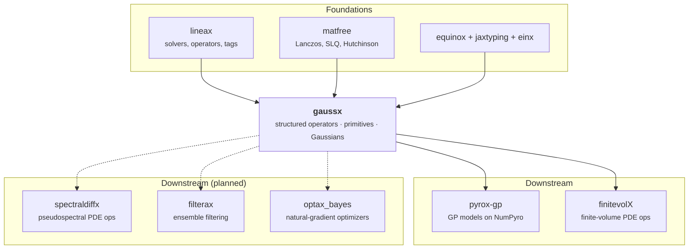

# Vision

> **gaussx** is a JAX/Equinox library for structured linear operators, Gaussian
> distributions, and exponential-family primitives.
>
> Or, less politely: your covariance matrix has structure, your code is throwing
> it away, and we would like a word.

## The thirty-second version

Somewhere in your program there is a matrix. It is not a random pile of numbers
--- it is a Kronecker product, or block diagonal, or low-rank plus a diagonal,
or Toeplitz, or the precision matrix of a Markov chain. It *knows* something
about itself.

And then you call `jnp.linalg.solve` on it, and all of that knowledge is
thrown in the bin, and your laptop spends four minutes doing arithmetic that a
pocket calculator could have done in one.

This is, we regret to say, barbaric.

```python
import gaussx

K = gaussx.Kronecker(A, B)   # 10,000 x 10,000, made of two 100 x 100 factors

x  = gaussx.solve(K, y)      # 100 x 100 twice, not 10,000 x 10,000 once
ld = gaussx.logdet(K)        # a weighted sum of two small logdets
L  = gaussx.cholesky(K)      # a Kronecker of two small Cholesky factors
```

Same three lines you already write. Same math you already know. Around half a
million times less arithmetic ($10^{12}$ flops down to $2 \times 10^6$). You are
welcome.

| If your matrix is... | Dense LAPACK | gaussx |
|---|---|---|
| Kronecker $A \otimes B$, factors $n_1, n_2$ | $O((n_1 n_2)^3)$ | $O(n_1^3 + n_2^3)$ |
| Block diagonal, $k$ blocks of size $m$ | $O((km)^3)$ | $O(k m^3)$ |
| Low-rank + diagonal, rank $k$ | $O(n^3)$ | $O(n k^2)$ via Woodbury |
| Block-tridiagonal (state-space), $N$ steps | $O((Nd)^3)$ | $O(N d^3)$ |
| Toeplitz | $O(n^3)$ | $O(n \log n)$ matvecs via FFT |
| Genuinely unstructured and enormous | it will not finish | matrix-free CG + stochastic logdet |

Those are not marketing numbers. They are the exponents. Exponents do not
negotiate.

## Why this keeps mattering

Linear algebra is the load-bearing wall of scientific computing, and almost
everyone treats it as wallpaper. Nearly every algorithm you care about
eventually bottlenecks on the same tiny handful of operations:

- **Linear regression** solves $(X^\top X)\beta = X^\top y$
- **Gaussian processes** need $(K + \sigma^2 I)^{-1} y$ and $\log|K + \sigma^2 I|$ for *every* likelihood evaluation
- **Kalman filters** compute the gain $K = P H^\top (H P H^\top + R)^{-1}$ at *every* time step
- **Variational inference** wants $\log|\Sigma|$ and samples from $\mathcal{N}(\mu, \Sigma)$ --- both need a square root
- **Natural gradients** invert the Fisher information, $F^{-1}\nabla\mathcal{L}$, at *every* update
- **Ensemble methods** build empirical covariances that are low-rank by construction
- **Spatial statistics on grids** produce $K_x \otimes K_y$, where $O(N^3)$ collapses to $O(n_x^3 + n_y^3)$
- **PDE solvers** invert elliptic operators and precondition iterative methods
- **Optimal transport** runs Sinkhorn iterations that are just matvecs wearing a hat

Five verbs --- `solve`, `logdet`, `cholesky`, `trace`, `sqrt` --- carry entire
research fields on their back. They deserve to be written once, by someone
paying attention.

## The part that is genuinely annoying

Here is what actually happens in the wild. The Woodbury identity gets
hand-coded in the GP library. Then again in the filtering library. Then again,
subtly differently and with one sign wrong, in the Bayesian optimization
library. Every implementation is *correct*, and every implementation is
*alone*.

So the bug fix in repo #1 never reaches repo #3. The clever preconditioner in
repo #2 dies with the PhD student who wrote it. And every newcomer must climb a
wall of bespoke matrix code before touching the science they actually came for.

We find this waste offensive. Not "inefficient" --- **offensive**. gaussx
exists to end it: write the structured operators and the dispatch once,
carefully, and let everyone downstream inherit the good version.

## But surely someone has done this?

Partly. Everyone has done a *piece* of it, and we say that with real affection
--- gaussx is built on two of them.

| Library | What it does beautifully | Where it stops |
|---------|--------------------------|----------------|
| **[lineax](https://github.com/patrick-kidger/lineax)** | Superb solvers (CG, Cholesky, LU, GMRES, ...), a clean operator abstraction, properly JAX-native | No Kronecker / block-diagonal / low-rank operators; no `logdet`, `trace`, or `sqrt` |
| **[CoLA](https://github.com/wilson-labs/cola)** | A rich operator zoo and real matrix functions | Multi-backend by design, so not Equinox-native; thinner solver coverage |
| **[TFP on JAX](https://www.tensorflow.org/probability)** | Battle-tested `LinearOperator`s with batching | Arrives towing an entire TensorFlow |

So: lineax has the solvers but not the shapes. CoLA has the shapes but not the
home. TFP has both and a suitcase.

**gaussx is the missing middle** --- lineax's solvers, a broader operator zoo, a
Gaussian distribution layer on top, and every last line of it native to
JAX and Equinox. One `pip install`. No suitcase.

## Who this is for

**The GP researcher.** *"My spatiotemporal kernel is Kronecker-structured. I
want `logdet` and `solve` to notice that by themselves, forever, without me
re-deriving the eigendecomposition trick at 1am."*

**The data-assimilation person.** *"Ensemble covariance is low-rank. Kalman gain
is Woodbury. I want to write `low_rank_plus_diag(noise, U)` and receive a real
structured operator, not a 40,000 x 40,000 dense array and a memory error."*

**The Bayesian ML researcher.** *"Natural gradients. I need natural
$\leftrightarrow$ expectation conversions and Fisher information for Gaussians,
over structured precision operators, differentiable end to end."*

**The library author.** *"I am building the next GP / filtering / optimization
package and I refuse to hand-roll `solve`, `logdet`, and `cholesky` with a
per-type dispatch table one more time."*

**The newcomer.** *"I would like `gaussx.solve(K, y)` to simply work."* It does.
That is the whole idea.

## Five principles we will not apologise for

| # | Principle | In practice |
|---|-----------|-------------|
| 1 | **Extend, don't replace** | We build on lineax's `AbstractLinearOperator` and its solvers. Rewriting excellent code to put your own name on it is vanity, not engineering. |
| 2 | **Structure drives dispatch** | Operators carry structural tags (PSD, symmetric, Kronecker, low-rank, ...). Primitives read the type and the tags and pick the fast path. Plain `isinstance` checks. No metaclasses, no registry, no mystery. |
| 3 | **Math-first layers** | `solve(A, b)`, `logdet(A)`, `cholesky(A)`. You should be able to read the source with the paper open and see the same equation. |
| 4 | **One distribution, many strategies** | `MultivariateNormal` takes *any* covariance operator and *any* solver strategy. The distribution owns the math; the strategy owns the numerics; neither is allowed to meddle. |
| 5 | **Readable tensor code** | Every reshape and contraction goes through [einx](https://github.com/fferflo/einx), so a Kronecker matvec reads like Roth's column lemma instead of like index golf. |

Principle 5 is the one people call fussy. It is not fussy. It is the difference
between code you can review and code you merely hope about.

## What gaussx refuses to be

A library that does everything does nothing especially well. We have chosen our
scope, and we intend to defend it.

| Not this | Go here instead |
|----------|-----------------|
| A GP modelling library (kernels with priors, model shells, inference loops) | [pyrox-gp](https://github.com/jejjohnson/pyrox) |
| Probabilistic programming (MCMC, SVI, samplers) | [NumPyro](https://github.com/pyro-ppl/numpyro) |
| General-purpose optimization | [optax](https://github.com/google-deepmind/optax) / [optimistix](https://github.com/patrick-kidger/optimistix) |
| PDE discretization, grids, boundary conditions | [finitevolX](https://github.com/jejjohnson/finitevolX) / [spectraldiffx](https://github.com/jejjohnson/spectraldiffx) |
| Ensemble filtering applications | [filterax](https://github.com/jejjohnson/filterax) |
| Bayesian optimizers as `optax` transforms | [optax_bayes](https://github.com/jejjohnson/optax_bayes) |
| Multi-backend support (PyTorch, NumPy, ...) | JAX only, on purpose, forever |

gaussx is structured operators and the primitives over them. That is the whole
job. Everything else is somebody else's excellent library, and we would rather
link to it than imitate it.

## The family

gaussx is the linear-algebra floor that the rest of the stack stands on.



The interesting one is the PDE column. Under the SPDE view, an elliptic
differential operator and a Gaussian precision operator are *the same object*
--- so [finitevolX](https://github.com/jejjohnson/finitevolX) already takes its
tridiagonal solves and Nyström preconditioner straight from gaussx, and
[spectraldiffx](https://github.com/jejjohnson/spectraldiffx) is queued to take
the capacitance (Woodbury) correction from the very same code that runs a GP
marginal likelihood. Fix the CG loop once; every library downstream gets
better. See
[Unified Solvers](design/unified-solvers.md) for how that boundary is drawn,
and the [Architecture](architecture.md) page for the full stack.

---

## Why "GaussX"?

**Gauss** + **JAX**. And no, that is not merely branding.

Carl Friedrich Gauss is arguably the most consequential figure in the history of
computational mathematics, and his fingerprints are on nearly every algorithm in
this library. **Gaussian elimination**, ancestor of every matrix factorization.
The **method of least squares**, which he invented in 1801 to find a lost
asteroid --- a genuinely outrageous flex. The **Gaussian distribution**. The
**Gauss-Markov theorem**, which explains *why* least squares is optimal. The
**Cholesky decomposition** is Gaussian elimination in formal dress. Even the
**FFT** traces back to a trick Gauss wrote down in 1805, a century and a half
before Cooley and Tukey published it.

The Gaussian distribution earns its place too. It is the **maximum-entropy**
distribution for a given mean and variance --- the least presumptuous thing you
can assume. It is the **fixed point of the Central Limit Theorem** --- where
sums end up regardless of where they started. It is the **conjugate prior** that
makes linear-Gaussian Bayesian inference exact rather than approximate. And it
is fully described by exactly two things: a mean vector, and a covariance
matrix.

That covariance matrix --- its structure, its factorization, its determinant,
its inverse --- is precisely and entirely what gaussx computes. Every primitive
in the library (`solve`, `logdet`, `cholesky`, `trace`, `sqrt`, `inv`) exists
because somebody, somewhere, needs to do something to a Gaussian covariance. GP
regression needs `solve` and `logdet`. Kalman filtering needs `cholesky`.
Variational inference needs `sqrt`. Natural gradients need `inv`. The structured
operators exist because real covariances are never the shapeless dense blobs the
textbook drew.

One mathematician, two centuries, five verbs, and a matrix that knows what it
is.

Voilà.
